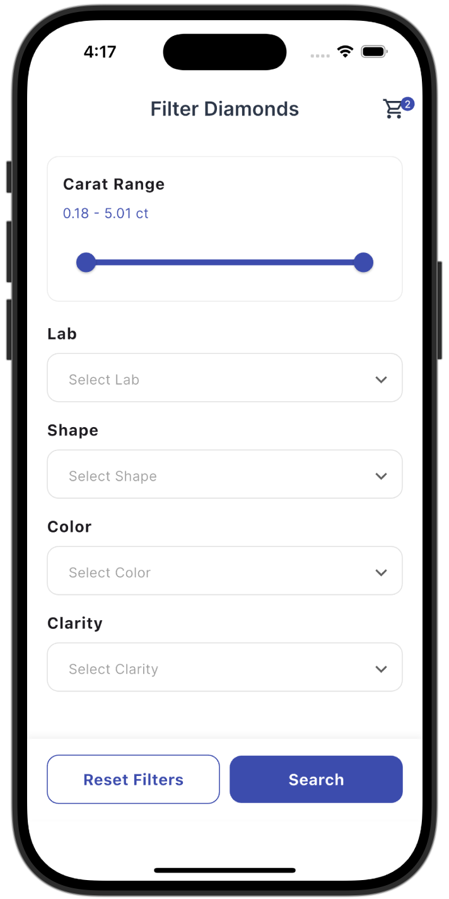
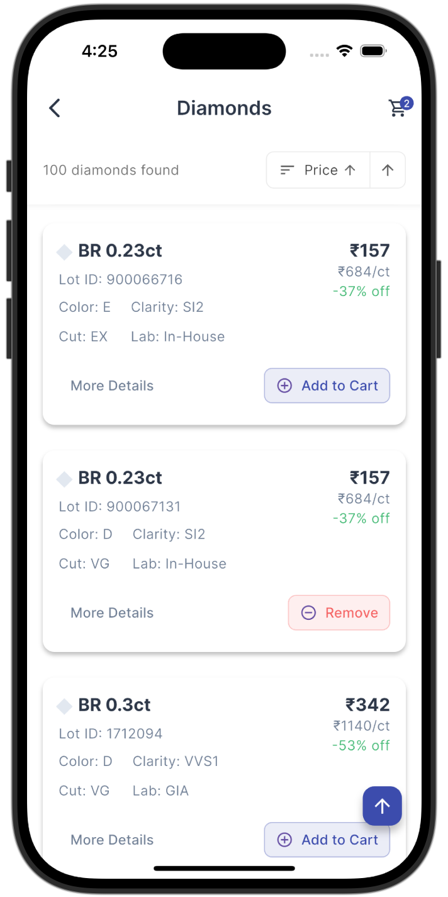
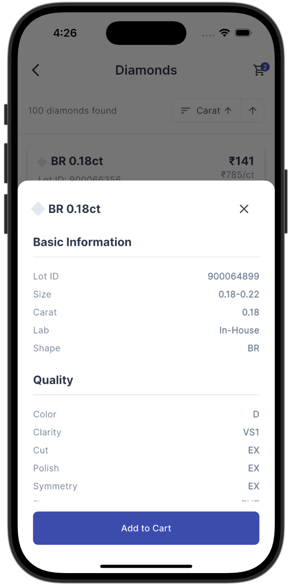
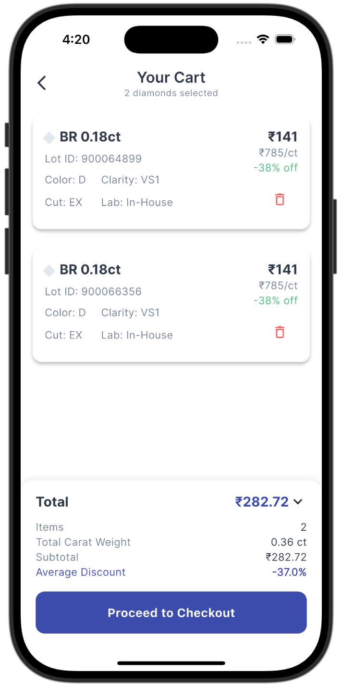

# Diamond Selection App

A Flutter application that allows users to **filter**, **sort**, **view**, and **manage a persistent cart** of diamonds. This project follows the **Clean Architecture** pattern with **BLoC state management** and **Hive for local storage**.

## Features

### **1. Filter Page**
- Users can filter diamonds based on:
  - **Carat Range (From & To)**
  - **Lab**
  - **Shape**
  - **Color**
  - **Clarity**
- A **Search** button applies filters and navigates to the **Result Page**.

### **2. Result Page**
- Displays filtered diamonds in a **ListView**.
- Sorting options:
  - **Final Price (Asc/Desc)**
  - **Carat Weight (Asc/Desc)**
- Users can **add/remove diamonds** from the cart directly.

### **3. Cart Page**
- Displays all diamonds **added to the cart**.
- Features:
  - **Remove** diamonds from cart.
  - **Persistent cart storage** (data remains even after app restart).
  - **Summary:**
    - Total Carat
    - Total Price
    - Average Price
    - Average Discount

## 📂 Project Structure
The project follows **Clean Architecture** with separate layers:

```
lib/
│── core/                  # Contains common utilities
│── data/                  # Data Layer (Models & Data Sources)
│   │── datasource/        # Local (Hive) storage management
│   │── model/             # Diamond data models
│── domain/                # Business Logic Layer (Use Cases & Repository Interface)
│   │── repository/        # Abstract repository contracts
│   │── usecases/          # Business logic functions
│── presentation/          # UI Layer (Pages, BLoC, Widgets)
│   │── bloc/              # BLoC state management
│   │── pages/             # UI screens (Filter, Results, Cart)
│── main.dart              # App entry point
```

## 📌 State Management (BLoC)

The app uses **Flutter BLoC** to manage state efficiently.

### **1️⃣ BLoC Events & States**

#### **Events**
- `FilterDiamondsEvent` → Filters diamonds based on user input.
- `AddToCartEvent` → Adds a diamond to the cart.
- `RemoveFromCartEvent` → Removes a diamond from the cart.
- `LoadCartDiamondsEvent` → Loads cart diamonds from local storage.

#### **States**
- `DiamondState` → Holds **filtered diamonds list** & **cart list**.

### **2️⃣ How BLoC Works**
1. **User applies filters** → `FilterDiamondsEvent` triggers filtering logic.
2. **Filtered diamonds are displayed** on the Results Page.
3. **User adds a diamond to cart** → `AddToCartEvent` stores it in Hive.
4. **Cart page loads saved diamonds** on restart using `LoadCartDiamondsEvent`.
5. **User removes a diamond** → `RemoveFromCartEvent` updates storage and UI.

## 💾 Persistent Storage (Hive)
- **Hive** is used to store cart data persistently.
- `hive_service.dart` manages local storage operations.
- Cart diamonds are **saved in a Hive box** and **reloaded after restart**.

## 🛠️ Installation & Setup

1. Clone the repository:
   ```sh
   git clone <repo_link>
   cd diamond-selection-app
   ```

2. Install dependencies:
   ```sh
   flutter pub get
   ```

3. Run the app:
   ```sh
   flutter run
   ```

## 📸 Screenshots

1. **Filter Page**  
   <p align="center">
      
   </p>

2. **Results Page**  
   <p align="center">
      
      
   </p>

3. **Cart Page**  
   <p align="center">
      
   </p>


